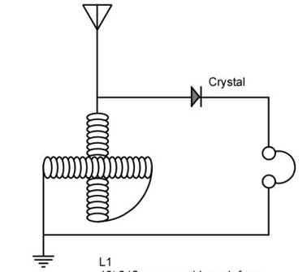
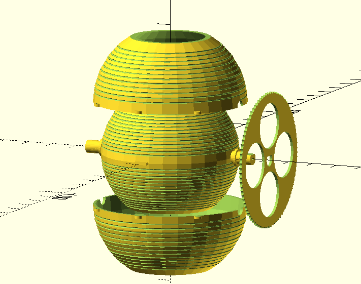

# Variometer (variable inductor) OpenSCAD generator

## Introduction

Allows generation of variometer with various parameters, such as winding wire diameter. Calculates and prints inducance estimation.

Tunes from 10 to 90 uH with default parameters.

Requires dotSCAD library: https://github.com/JustinSDK/dotSCAD, should be cloned into OpenSCAD libraries directory https://en.wikibooks.org/wiki/OpenSCAD_User_Manual/Libraries. 

# Model 

